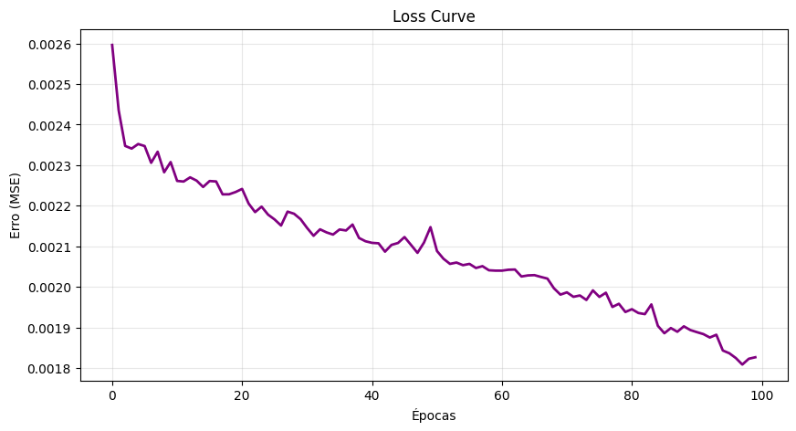
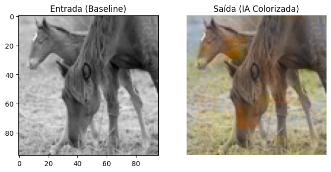
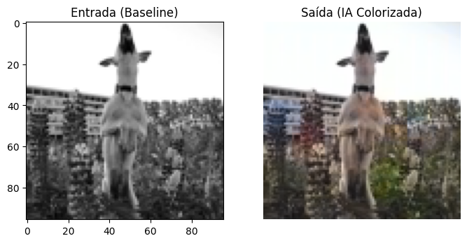
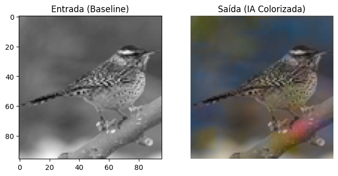
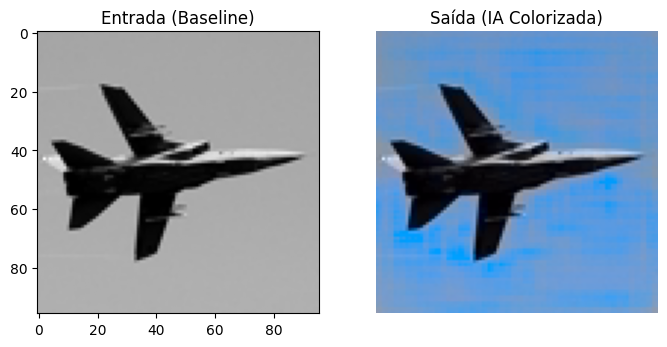
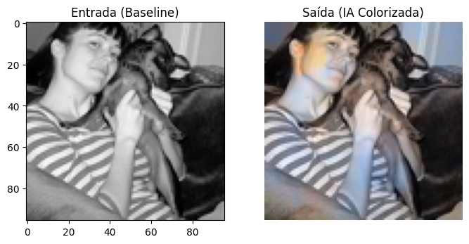

# Image Colorizer - Color Recovery in Black and White Images

## Description

This project implements a **Deep Learning** model that uses **Transfer Learning** to automatically colorize black and white images. The approach employs the pre-trained **ResNet-18** architecture as an encoder and works in the **Lab color space**, where the luminosity channel (L) is used as input to predict the color channels (ab).

## Results and Demonstration

The model demonstrates the ability to assign semantically coherent colors to different categories of objects. Below are some examples of colorization performed by the AI compared to the baseline (grayscale).
### Loss Curve
The graph below shows the convergence of the error during the neural network training.

### Colorization Examples

| Category | Visual Result | Metric (PSNR) |
| :--- | :--- | :---: |
| **Horsers** |  | **30.48 dB** |
| **Dog** |  | **27.52 dB** |
| **Bird** |  | **29.69 dB** |
| **Airplane** |  | **26.54 dB** |
| **Woman & Dog** |  | **28.25 dB** |

*Note: Higher PSNR values indicate greater fidelity in reconstructing the original colors.*

---

## Context

Automatic image colorization is a challenging task that requires semantic understanding of visual content. This project was developed as part of the **MEISSA** training program (LIAD/HP), exploring advanced techniques in Computer Vision and Transfer Learning.

## Technologies Used

- **Python 3.x**
- **PyTorch** - Deep Learning Framework
- **ResNet-18** - Pre-trained architecture (Transfer Learning)
- **Scikit-image** - Image processing and conversion (Lab Space)
- **Matplotlib** - Visualization of results

## Methodology

1. **Lab Color Space**: The L channel (Luminosity) is the input, and the 'ab' channels (Colors) are the predicted output.
2. **Encoder-Decoder**: Encoder based on ResNet-18 for feature extraction and a convolutional decoder for reconstruction.
3. **Dataset**: Trained with the **STL-10** dataset (Stanford).

## How to Run

Click the "Open in Colab" badge at the top of this README to run the notebook directly in your browser.

## Author

**Luiz Anselmo Medeiros Lima**
- GitHub: [@luizmlima](https://github.com/luizmlima)
- LinkedIn: [Luiz Anselmo Lima](https://www.linkedin.com/in/luiz-anselmo-lima)

## MEISSA Project

This project was developed as part of the **MEISSA** training program, a partnership between the **Laboratório de Inteligência Artificial e Arquiteturas Dedicadas (LIAD)** and **HP**.
